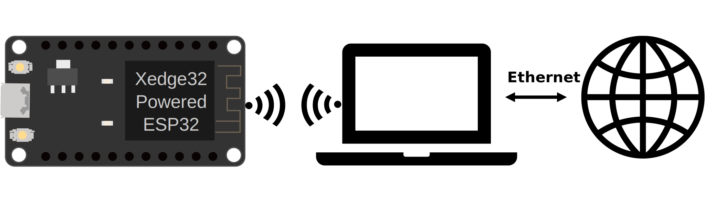

Access Point Mode
===================

After successfully :ref:`flashing the firmware <flashing-the-firmware>` onto your ESP32 for the first time, Xedge32 automatically configures the ESP32 to operate in access point mode.  The default name of this access point is ``xedge32``.

Connecting to Xedge32
------------------------------------

1. **Connecting to the Access Point**:

   - On your device, connect to the ``xedge32`` Wi-Fi network. The default password is 1234 (can be changed).

2. **Accessing the Web Interface**:

   - Open a web browser and navigate to ``http://xedge32.local``. 
   - **Note**: If you're using a computer that does not support mDNS, you will not be able to access the URL ``http://xedge32.local``. Instead, use the IP address ``http://192.168.190.0``.

3. **Navigating to Xedge32 IDE**:

   - Upon accessing ``http://xedge32.local``, you'll be greeted with a default 404 page. Here, click on the ``Xedge IDE`` link to proceed to the :ref:`Xedge IDE Web Editor<Xedge32>`.

Access Point Mode Considerations
------------------------------------

While in access point mode, be aware that the web-based editor will be a basic HTML textarea, not the advanced Visual Studio Code-like editor you will see if your computer can access the Internet. If you prefer to keep your ESP32 in access point mode for development, it's recommended to use a computer that is connected to the ESP32 via Wi-Fi and simultaneously to the Internet through a wired connection, as shown in the figure below. This setup ensures that the advanced web-based code editor can be loaded from the Internet.

   Figure 1: Loading the advanced code editor when in access point mode

Switching to Station Mode
------------------------------------

**Station Mode** is the recommended mode for Xedge32, as it enables the full range of IoT features available in this tool. To switch from **Access Point Mode** to **Station Mode**, follow these steps:

1. **Accessing the Lua Shell**:

   - Click the three dots (``...``) in the upper right corner of the Xedge editor.
   - Select **Lua Shell** to open the web-based :ref:`LuaShell32`.

2. **Programming Station Mode**:

   - In LuaShell32, enter the following command to connect to your Wi-Fi network::

       esp32.netconnect("wifi", {ssid="your-Wi-Fi-SSID", pwd="password"})

     Replace ``your-Wi-Fi-SSID`` and ``password`` with your actual Wi-Fi credentials.

3. **Switching Modes**:

   - The ESP32 will attempt to switch from **Access Point Mode** to **Station Mode**.
   - If the connection is successful, the ESP32 remains in **Station Mode**.
   - If the connection fails, the ESP32 reverts to **Access Point Mode**.

4. **Reconnecting the ESP32 when in Station Mode**:

   - If your computer supports mDNS, reconnect with the ESP32 by navigating to ``http://xedge32.local/`` or simply refresh the browser window.
   - If your computer does not support mDNS, find the ESP32's new IP address assigned by your router. This is typically found on the router's DHCP client list page, where the ESP32 should appear as ``xedge``.

Station Mode Considerations
------------------------------------

Here are the best practices for navigating to your ESP32 when in Station Mode:

   -  **http://xedge32.local:** You can navigate to http://xedge32.local/ if you are using the Pre-Compiled Firmware or have enabled mDNS when you compiled your own firmware. **Note:**

      - You can change the mdns name using :ref:`esp32-execute-label`.
      - mDNS can be slower than standard DNS. This is because mDNS typically requires additional time to resolve local network names into IP addresses. In some cases, this might lead to noticeable delays when accessing your device. Given the potential slower response times with mDNS, you may consider using the alternative methods to connect to your ESP32.

   -  **IP Address Assignment:** The ESP32 gets an IP address from the network's DHCP (Dynamic Host Configuration Protocol). Usually, your router will assign the same IP address each time the ESP32 reconnects to the network. You can bookmark this IP address in your web browser. That way, the next time you power on your ESP32, you can simply click the bookmark to connect to it.

   -  **Consistent IP Address with DHCP Reservations:** If you want to make sure the ESP32 always uses the same IP address, most routers allow you to reserve that IP address specifically for your device using `DHCP reservations <https://portforward.com/dhcp-reservation/>`_. This ensures consistent IP address assignment for the ESP32.

   -  **Using Let's Encrypt Plugin - SharkTrust:** As an alternative, you can also enable a permanent URL for your ESP32 by activating the Let's Encrypt plugin called SharkTrust through the `Xedge's configuration menu <https://realtimelogic.com/ba/doc/?url=Xedge.html#cert>`_.

By following the above instructions, you can easily browse to your your ESP32 device without using a serial connection to discover the IP address assignment.

Switching Back to Access Point Mode
------------------------------------

When in **Station Mode**, the ESP32 does not automatically revert to **Access Point Mode**, even when it cannot connect. This design is for security purposes. To manually switch back:

- In LuaShell32, execute the following command::

    esp32.netconnect()

This command will switch the ESP32 back to **Access Point Mode**.
