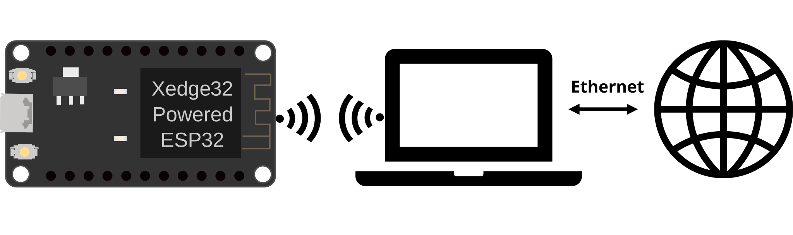

.. _Access Point Mode:

Access Point Mode
=================

After you :ref:`flash the firmware <flashing-the-firmware>` for the first
time, Xedge32 starts in **Access Point Mode**. In this mode, the ESP32 creates
its own Wi-Fi network so you can connect to the device even before it has been
configured for your local network.

The default access point name is ``xedge32``. This startup mode is especially
useful during first-time setup, lab work, and field service, since it gives you
an immediate path to the device without requiring a pre-existing network.

Connecting to Xedge32
---------------------

Use the following sequence the first time you connect:

1. Connect your phone or computer to the ``xedge32`` Wi-Fi network.
   The default password is ``12345678``.
2. Open a browser and navigate to `http://xedge32.local
   <http://xedge32.local>`_.
3. If your computer does not support mDNS, use the default AP address
   ``http://192.168.190.0`` instead.
4. The first page you see is a default 404 page. Click the ``Xedge IDE`` link
   to open the :ref:`Xedge IDE Web Editor <Xedge32>`.

.. note::

   The default SSID and password are intended for initial onboarding. If you
   plan to keep a device in Access Point Mode for extended development or field
   use, update the configuration to match your deployment requirements.

.. note::

   Custom firmware builds can use a different AP address. If
   ``xedge32.local`` does not resolve and the default address does not respond,
   open the serial console and check the boot log for the printed AP IP
   address.

Access Point Mode Considerations
--------------------------------

Access Point Mode is primarily a setup and recovery mode. It is fully usable,
but there are a few details worth knowing:

- The built-in editor always works, but on computers without Internet access it
  falls back to a basic HTML text area instead of the richer Monaco-based
  editor.
- If you want the more advanced browser editor while still keeping the ESP32 in
  Access Point Mode, use a computer that is connected to the ESP32 over Wi-Fi
  and to the Internet over another interface such as Ethernet.
- This mode is also convenient when you are bringing up a device on a workbench
  and do not yet want it to join a production network.

   Figure 1: Loading the advanced editor while the ESP32 remains in Access
   Point Mode.

Switching to Station Mode
-------------------------

**Station Mode** is the recommended operating mode for most projects because it
lets Xedge32 join your normal network and use the full set of IoT-oriented
features.

To switch from Access Point Mode to Station Mode:

1. Open the web interface and click the three dots (``...``) in the upper-right
   corner.
2. Select **Lua Shell** to open :ref:`LuaShell32`.
3. Run the following command:

   .. code-block:: lua

      esp32.netconnect("wifi", {ssid="your-Wi-Fi-SSID", pwd="password"})

4. Replace ``your-Wi-Fi-SSID`` and ``password`` with your own credentials.
5. Wait while the ESP32 attempts to join the network.

If the connection succeeds, the device stays in Station Mode. If the connection
attempt fails during initial configuration, Xedge32 falls back to Access Point
Mode so you can correct the settings and try again.

Reconnecting After the Mode Change
----------------------------------

Once the ESP32 has joined your network:

- If your computer supports mDNS, reconnect by browsing to
  ``http://xedge32.local/``.
- If your computer does not support mDNS, find the new IP address in your
  router's DHCP client list. The device typically appears as ``xedge``.

.. note::

   If you were already connected to the IDE through ``http://xedge32.local/``
   and both your computer and the ESP32 can still reach each other after the
   mode change, the IDE may reconnect automatically. It is normal to briefly
   see disconnect and reconnect messages in the IDE console before the final
   ``connected`` message appears.

Station Mode Considerations
---------------------------

Once your device runs in Station Mode, one of the following connection methods
is usually the most convenient:

- ``http://xedge32.local/`` if you are using the precompiled firmware or a
  custom build with mDNS enabled.
- The DHCP-assigned IP address if you prefer direct IP access.
- A DHCP reservation on your router if you want the same IP address every time.
- A permanent public URL by enabling the SharkTrust Let's Encrypt plugin from
  `Xedge's configuration menu
  <https://realtimelogic.com/ba/doc/?url=Xedge.html#cert>`_.

Additional notes:

- You can change the mDNS name by using :ref:`esp32-execute-label`.
- mDNS is convenient, but it may resolve more slowly than normal DNS on some
  networks.
- Bookmarking a stable IP address or using a DHCP reservation is often the most
  practical choice for long-term development.

Switching Back to Access Point Mode
-----------------------------------

After the ESP32 has successfully connected in Station Mode at least once, it
does not automatically revert to Access Point Mode if later network attempts
fail. This behavior is intentional and helps prevent accidental exposure of the
device as an access point.

To switch back manually, run the following command in :ref:`LuaShell32`:

.. code-block:: lua

   esp32.netconnect"wifi"

This disconnects the device from Wi-Fi Station Mode and restores the original
Access Point Mode behavior.
