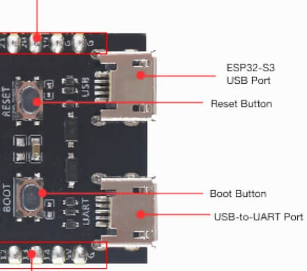

Getting Started
================

To start using Xedge, you need to upload the firmware onto an ESP32-S3 or an ESP32 with PSRAM (for example, the ESP32 WROVER). You can do this using a flashing tool or programming software. We suggested purchasing the new improved `ESP32-S3 <https://www.google.com/search?q=esp32-S3>`_ if you do not have a suitable ESP32.

Web Installer
~~~~~~~~~~~~~~

For advanced installation options, refer to the instructions below. However, we **highly recommend** using the *user-friendly web-based installer*, which you can find on the `Xedge32 introduction page <https://realtimelogic.com/downloads/bas/ESP32/#install>`_.

Binaries or Source Code
~~~~~~~~~~~~~~~~~~~~~~~~

We offer two options for the firmware:

1. Ready-to-use firmware binary files which you can directly upload onto your board.
2. C source code files which you can compile using the Espressif ESP-IDF toolchain.

**Important:** We provide instructions suitable for both the ESP32 and the newer ESP32-S3 chips. Make sure to follow the correct instructions for the chip that you're using.

.. contents:: Get started as follows:
   :depth: 2
   :local:

.. _flashing-the-firmware:

Firmware Option 1: Use Pre-Compiled Firmware
---------------------------------------------

The firmware binaries can be uploaded using Windows, Mac, and Linux using the command line tool `esptool`. Refer to the instructions below for details. We will start by showing how to use a graphical installer, which is only compatible with Windows.

ESP32 Pre-Compiled Firmware Requirements
~~~~~~~~~~~~~~~~~~~~~~~~~~~~~~~~~~~~~~~~~

Before you begin, ensure your ESP32 device meets the following requirements for the pre-compiled firmware:

- **Standard ESP32**: Requires a minimum of 4MB flash memory and 4MB RAM.
- **ESP32-S3 Variant**: Requires a minimum of 8MB flash memory and 8MB RAM, but comes with additional features:

  - **OPC UA Plugin**: This is included by default, offering advanced communication capabilities.
  - **Over-The-Air (OTA) Updates**: Enables easy firmware upgrades.

Windows Graphical Installer
~~~~~~~~~~~~~~~~~~~~~~~~~~~~

.. raw:: html

   
<iframe src="https://www.youtube.com/embed/V-HH0yc74hY" frameborder="0" allowfullscreen style="position: absolute;top: 0;left: 0;width: 100%;height: 100%;"></iframe>

**How to flash the Xedge32 IDE**

To upload the Xcode32 firmware to your ESP32 board, begin by downloading the `ESPRESSIF Flash Tool <https://www.espressif.com/en/support/download/other-tools>`_ and one of:

- `ESP32  Xedge Firmware <https://realtimelogic.com/downloads/bas/Xedge32-Firmware.zip>`_
- `ESP32-S3  Xedge Firmware <https://realtimelogic.com/downloads/bas/Xedge32-S3-Firmware.zip>`_: includes two firmware files. See the `firmware-options`_ for details.

Unzip the `ESPRESSIF Flash Tool` archive and the `Xedge32-Firmware.zip` or `Xedge32-S3-Firmware.zip archive`.

1. Connect your ESP32 board to your computer and find the com port used by using the Device Manager.
2. Start the ESPRESSIF Flash Tool `flash_download_tool_3.9.4.exe` executable.
3. When the tool starts, select ChipType ESP32 or ESP32-S3 and click OK.
4. On the SPIDownload page, `set the COM port to the one used by the ESP32 <https://learn.adafruit.com/adafruit-esp32-s2-feather/advanced-serial-console-on-windows>`_ and set Speed to 115200.
5. Click the ERASE button and wait for it to complete.
6. Click the 3 dots (...) to browse to the bin files you downloaded.
7. Select the following binary files and set the address accordingly:

   a. Option 1: When using the merged binary firmware file merged-xedge.bin

      +-----------------------+--------------+
      | Binary File           |    Address   |
      +=======================+==============+
      | `merged-xedge.bin`    | `0x0`        |
      +-----------------------+--------------+

      Click the checkbox to the left of the binary file to select it.

   b. Option 2: When using the three separate binary files
   
      +-----------------------+-------------------+-------------------+
      | Binary File           |   ESP32 Address   | ESP32-S3 Address  |
      +=======================+===================+===================+
      | `bootloader.bin`      | `0x1000`          | `0x0`             |
      +-----------------------+-------------------+-------------------+
      | `partition_table.bin` | `0x8000`          | `0x8000`          |
      +-----------------------+-------------------+-------------------+
      | `xedge.bin`           | `0x10000`         | `0x20000`         |
      +-----------------------+-------------------+-------------------+

      Click the three checkboxes to the left of the three bin files to select them.

8.  Do not change any other values.
9. Click the START button and wait for it to upload the bin files to your ESP32.
10. When completed, open a terminal emulator such as Putty.
11. You should see a terminal window with text being printed, as shown in the screenshot below.
12. When you see `LuaShell32 ready` being printed, proceed by :ref:`configuring the ESP32 <configesp32>` as explained below.

.. image:: https://realtimelogic.com/images/Xedg32-Flash-Firmware.png
   :alt: Firmware Upload Tool

The screenshot above displays the firmware tool on the left with three separate binary files selected, and on the right, it shows a Putty terminal connected to the device. Option one is more user-friendly as it employs a merged binary firmware file, combining the three separate files into one entity.

**Potential Issues and Solutions:**

   -  On certain boards, you must press the boot button before connecting the USB. Once the USB is plugged in, you can release the button.
   -  If you're using an ESP32-S3 board equipped with both USB-OTG and USB-UART, you will need to perform flashing using the USB-UART connection. Meanwhile, connect Putty to USB-OTG.
   - If you do not see the :ref:`LuaShell32` after connecting Putty, try the following: Configure Putty with the required serial connection parameters so you can quickly click the Open button, then do as follows: Click the ESP32 development board's reset button, followed by quickly clicking the Open button in Putty.

Linux, Mac, and Windows using the command line tool `esptool`
~~~~~~~~~~~~~~~~~~~~~~~~~~~~~~~~~~~~~~~~~~~~~~~~~~~~~~~~~~~~~~~

The following examples show how to use Linux. The commands are similar for Mac and Windows.

Install the required tool:

.. code-block:: sh

   sudo apt install python3-pip
   pip install esptool

Upload the **ESP32** firmware:

.. code-block:: sh

   wget https://realtimelogic.com/downloads/bas/Xedge32-Firmware.zip
   unzip Xedge32-Firmware.zip
   cd Xedge32-Firmware

   # Use one of:

   # python -m esptool --chip esp32 --before default_reset --after hard_reset write_flash --flash_mode dio --flash_size detect --flash_freq 40m 0x0 merged-xedge.bin

   # python -m esptool --chip esp32 --before default_reset --after hard_reset write_flash --flash_mode dio --flash_size detect --flash_freq 40m 0x1000 bootloader.bin 0x8000 partition-table.bin 0x10000 xedge.bin

Upload the **ESP32-S3** firmware:

.. code-block:: sh

   wget https://realtimelogic.com/downloads/bas/Xedge32-S3-Firmware.zip
   unzip Xedge32-S3-Firmware.zip
   cd Xedge32-Firmware

   # Use one of:

   # python -m esptool --chip esp32s3 --before default_reset --after hard_reset write_flash --flash_mode dio --flash_size detect --flash_freq 80m 0x0 merged-xedge.bin

   # python -m esptool --chip esp32s3 --before default_reset --after hard_reset write_flash --flash_mode dio --flash_size detect --flash_freq 80m 0x0 bootloader.bin 0x8000 partition-table.bin 0x20000 xedge.bin

.. _firmware-options:

For the ESP32-S3, we provide two firmware options
-------------------------------------------------

**xedge.bin (merged-xedge.bin)**
   - Tailored for boards like "xiao esp32-s3" with a single USB port.
   - This firmware activates the Xedge32 console :ref:`LuaShell32` through the USB port.

**xedge-s0.bin (merged-xedge-s0.bin)**
   - Ideal for boards that utilize serial UART0 for flashing or console logging. The USB to serial converter chip, such as CP210x or FTDI, can be integrated or external.
   - This firmware version initializes the Xedge32 console using :ref:`LuaShell32` via the USB-to-UART serial connection.

.. note::
   If you upload the xedge.bin software via USB-to-UART, and your board has two USB ports, you'll need to switch to the other USB port after uploading. However, with xedge-s0.bin, you can continue using the same USB-to-UART port.

Firmware Option 2: Compile The Code
-------------------------------------

See the `GitHub Repository <https://github.com/RealTimeLogic/Xedge-ESP32>`_ for details.

Configure the ESP32
--------------------------

.. _configesp32:

Once the firmware upload is complete, reboot the ESP32. The ESP32 will be in Access Point mode after restarting. You can now :ref:`connect to it using a serial terminal <LuaShell32>` or :ref:`access the web-based shell by connection to the access point <Access Point Mode>`. Select one of these options and program the ESP32 as follows if you want it to connect to your network and not operate as an access point:

In the :ref:`LuaShell32` prompt, type the following to connect to your network:

   -  Using **Wi-Fi**:

   .. code-block:: lua

      esp32.netconnect("wifi", {ssid="your-Wi-Fi-SSID", pwd="password"})

   -  Using **Ethernet**:

   .. code-block:: lua

      esp32.netconnect("W5500", {spi-settings})

The next time you turn on your ESP32 device, it will automatically connect to your Wi-Fi network, so there's no need to reconnect the serial console and use the LuaShell32.

Next Step
------------

Once Xedge has successfully connected to your network, continue your journey by exploring our guide on how to use :ref:`Xedge32` .

Upgrading the Firmware
------------------------

The pre-compiled firmware for the ESP32-S3 features convenient drag-and-drop upgrades. To upgrade Xedge32, you have two options:

1. Follow the detailed firmware installation process described in this tutorial.
2. Opt for the more straightforward drag-and-drop method. For more information on the drag-and-drop upgrade, refer to the blogpost `drag-and-drop firmware upgrade <https://www.linkedin.com/feed/update/urn:li:activity:7123087429762256896>`_ for details. Note that when using the drag-and-drop method, **you must use 'xedge.bin' or 'xedge-s0.bin'** instead of the merged firmware file.

Support and Discussions
------------------------

If you encounter any issues, have questions, or simply want to join discussions about the firmware, our main platform for support is the GitHub Discussions page for the project.

Please visit the `Xedge32 Discussions on GitHub`_ for assistance and community interactions.

.. _Xedge32 Discussions on GitHub: https://github.com/RealTimeLogic/Xedge32/discussions
