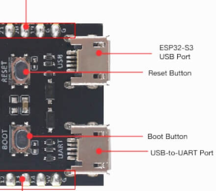

Getting Started
===============

To start using Xedge32, you first need to install the firmware on a supported
ESP32 board. The precompiled firmware targets:

- **Standard ESP32 boards with PSRAM**, such as ESP32 WROVER, with at least
  4 MB flash and 4 MB RAM.
- **ESP32-S3 boards**, with at least 8 MB flash and 8 MB RAM.

If you are completely new to Xedge32, start with the precompiled firmware and
the default onboarding workflow. More advanced build and upgrade paths are
included later on this page.

Before flashing your first board, it can also help to read `How Xedge32,
Xedge, and Barracuda App Server Work Together
<https://realtimelogic.com/articles/How-Xedge32-Xedge-and-Barracuda-App-Server-Work-Together>`_.
That article explains which parts are generic Xedge/BAS features and which
parts are specific to ESP32 hardware.

First-Time Installers
---------------------

For the easiest first installation, use the web installer on the `Xedge32
installation page <https://realtimelogic.com/downloads/bas/ESP32/#install>`_.
That installer is the quickest route to a working device because it avoids
manual flash addresses and command-line tools.

If you need more control over flashing, board selection, or firmware variants,
continue with the manual instructions below.

OTA Upgrade
-----------

If Xedge32 is already installed on an ESP32-S3, you can upgrade it with the
`integrated Xedge32 OTA Upgrade Manager <https://youtu.be/GHBcjeO-Yhc>`_.

Typical OTA workflow:

1. Download the latest `ESP32-S3 firmware ZIP file
   <https://realtimelogic.com/downloads/bas/Xedge32-S3-Firmware.zip>`_.
2. Extract the ZIP file.
3. Open the OTA Upgrade Manager.
4. Drag either ``xedge.bin`` or ``xedge-s0.bin`` onto the upgrade page.

This upgrade path is especially convenient once a board is already deployed and
reachable through the Xedge32 interface.

Advanced Installation and Upgrade
---------------------------------

Two firmware delivery models are available:

1. Precompiled binary files that you can flash directly to the board.
2. Source code that you can build yourself with the Espressif ESP-IDF toolchain.

.. important::

   The instructions on this page cover both ESP32 and ESP32-S3 hardware. Make
   sure you follow the command sequence and firmware layout that matches your
   specific chip.

.. contents:: Page contents
   :depth: 2
   :local:

.. _flashing-the-firmware:

Firmware Option 1: Use Precompiled Firmware
~~~~~~~~~~~~~~~~~~~~~~~~~~~~~~~~~~~~~~~~~~~

The precompiled firmware can be flashed from Windows, macOS, or Linux. We begin
with the Windows graphical workflow because it is the most approachable for
many first-time users, then show the ``esptool`` command-line workflow.

Windows Graphical Installer
^^^^^^^^^^^^^^^^^^^^^^^^^^^

.. raw:: html

   
<iframe src="https://www.youtube.com/embed/V-HH0yc74hY" frameborder="0" allowfullscreen style="position: absolute;top: 0;left: 0;width: 100%;height: 100%;"></iframe>

How to Flash the Xedge32 Firmware
^^^^^^^^^^^^^^^^^^^^^^^^^^^^^^^^^

Download the `ESPRESSIF Flash Tool
<https://www.espressif.com/en/support/download/other-tools>`_ and one of the
following firmware packages:

- `ESP32 Xedge firmware <https://realtimelogic.com/downloads/bas/Xedge32-Firmware.zip>`_
- `ESP32-S3 Xedge firmware <https://realtimelogic.com/downloads/bas/Xedge32-S3-Firmware.zip>`_
  which includes two firmware variants. See :ref:`firmware-options`.

After downloading, extract the flash tool archive and the firmware ZIP file.

Then follow these steps:

1. Connect the ESP32 board to your computer.
2. Identify the COM port in Windows Device Manager.
3. Start ``flash_download_tool_3.9.4.exe``.
4. Select the correct chip type, ``ESP32`` or ``ESP32-S3``, and click
   :guilabel:`OK`.
5. On the ``SPIDownload`` page, set the correct COM port and set the speed to
   ``115200``.
6. Click :guilabel:`ERASE` and wait for the erase operation to complete.
7. Use the browse buttons to select the firmware file or files.
8. Apply one of the following flash layouts.

Option 1: Merged Firmware File
""""""""""""""""""""""""""""""

Use this when flashing ``merged-xedge.bin``:

.. list-table::
   :header-rows: 1

   * - Binary File
     - Address
   * - ``merged-xedge.bin``
     - ``0x0``

Select the checkbox to the left of the file entry after adding it.

Option 2: Separate Firmware Files
"""""""""""""""""""""""""""""""""

Use this when flashing the individual binary components:

.. list-table::
   :header-rows: 1

   * - Binary File
     - ESP32 Address
     - ESP32-S3 Address
   * - ``bootloader.bin``
     - ``0x1000``
     - ``0x0``
   * - ``partition_table.bin``
     - ``0x8000``
     - ``0x8000``
   * - ``xedge.bin``
     - ``0x10000``
     - ``0x20000``

Enable all three checkboxes after selecting the files.

Finish the Flash Process
""""""""""""""""""""""""

9. Leave the remaining tool settings unchanged.
10. Click :guilabel:`START` and wait for the upload to finish.
11. Open a serial terminal such as PuTTY.
12. Watch the boot log.
13. When ``LuaShell32 ready`` appears, continue with
    :ref:`configesp32`.

.. image:: https://realtimelogic.com/images/Xedg32-Flash-Firmware.png
   :alt: Firmware Upload Tool

The screenshot above shows the flash tool on the left and a terminal window on
the right. The merged firmware option is simpler because it packages the
required firmware parts into a single file.

Common Flashing Issues
^^^^^^^^^^^^^^^^^^^^^^

- Some boards require you to hold the boot button while connecting USB. Once
  the board is detected, you can release the button.
- On ESP32-S3 boards with both USB-OTG and USB-UART, use the USB-UART port for
  flashing. If needed, use the other port for the runtime console.
- If PuTTY does not show :ref:`LuaShell32`, prepare the serial terminal first,
  then press the board's reset button and immediately open the terminal
  connection.

Linux, macOS, and Windows with ``esptool``
^^^^^^^^^^^^^^^^^^^^^^^^^^^^^^^^^^^^^^^^^^^

The following examples use Linux syntax, but the same ``esptool`` commands can
be adapted for macOS and Windows.

Install the required tool:

.. code-block:: sh

   sudo apt install python3-pip
   pip install esptool

Upload the **ESP32** firmware:

.. code-block:: sh

   wget https://realtimelogic.com/downloads/bas/Xedge32-Firmware.zip
   unzip Xedge32-Firmware.zip
   cd Xedge32-Firmware

   # Use one of:

   # python -m esptool --chip esp32 --before default_reset --after hard_reset write_flash --flash_mode dio --flash_size detect --flash_freq 40m 0x0 merged-xedge.bin

   # python -m esptool --chip esp32 --before default_reset --after hard_reset write_flash --flash_mode dio --flash_size detect --flash_freq 40m 0x1000 bootloader.bin 0x8000 partition-table.bin 0x10000 xedge.bin

Upload the **ESP32-S3** firmware:

.. code-block:: sh

   wget https://realtimelogic.com/downloads/bas/Xedge32-S3-Firmware.zip
   unzip Xedge32-S3-Firmware.zip
   cd Xedge32-Firmware

   # Use one of:

   # python -m esptool --chip esp32s3 --before default_reset --after hard_reset write_flash --flash_mode dio --flash_size detect --flash_freq 80m 0x0 merged-xedge.bin

   # python -m esptool --chip esp32s3 --before default_reset --after hard_reset write_flash --flash_mode dio --flash_size detect --flash_freq 80m 0x0 bootloader.bin 0x8000 partition-table.bin 0x20000 xedge.bin

.. _firmware-options:

ESP32-S3 Firmware Options
^^^^^^^^^^^^^^^^^^^^^^^^^

Two runtime variants are provided for ESP32-S3 boards:

**``xedge.bin`` / ``merged-xedge.bin``**
   Best for boards such as the XIAO ESP32-S3 that expose a single USB port.
   This build provides :ref:`LuaShell32` over that USB connection.

**``xedge-s0.bin`` / ``merged-xedge-s0.bin``**
   Best for boards that use UART0 for flashing or console access through a
   USB-to-UART bridge such as CP210x or FTDI.

.. note::

   If you flash ``xedge.bin`` over a USB-to-UART adapter on a two-port board,
   you may need to move to the other USB port after flashing in order to access
   the runtime console. If you use ``xedge-s0.bin``, you can usually keep using
   the same USB-to-UART connection.

Firmware Option 2: Compile the Code
~~~~~~~~~~~~~~~~~~~~~~~~~~~~~~~~~~~

If you need to customize the firmware itself, use the source tree and build
instructions in the `GitHub repository
<https://github.com/RealTimeLogic/Xedge-ESP32>`_.

Compiling the firmware is the right approach when you need custom C extensions,
build-time configuration changes, or tighter control over the final image.

.. _configesp32:

Configure the ESP32
-------------------

After flashing, reboot the ESP32. On first boot, Xedge32 starts in Access Point
Mode. From there, you can either connect over serial or connect to the device's
Wi-Fi access point and use the web-based shell.

Relevant guides:

- :ref:`LuaShell32` for serial or web-shell access
- :ref:`Access Point Mode` for browser-based onboarding

If you want the device to join your normal network instead of staying in Access
Point Mode, open :ref:`LuaShell32` and run one of the following commands.

Using Wi-Fi
~~~~~~~~~~~

.. code-block:: lua

   esp32.netconnect("wifi", {ssid="your-Wi-Fi-SSID", pwd="password"})

Using Ethernet
~~~~~~~~~~~~~~

.. code-block:: lua

   esp32.netconnect("W5500", {spi-settings})

On a successful connection, the configuration is stored so the device can
reconnect automatically after the next restart.

Next Step
---------

Once Xedge32 is connected to your network, continue with :ref:`Xedge32` to
learn how to upload examples, create applications, and work with the IDE.

Firmware Upgrade Options
------------------------

For ESP32-S3 boards, ongoing upgrades are usually simpler than the initial
install. You can either:

1. Repeat the firmware flashing procedure and upload only ``xedge.bin`` or
   ``xedge-s0.bin``.
2. Use the drag-and-drop OTA workflow described earlier on this page.

Support and Discussions
-----------------------

If you run into issues, want to compare notes with other users, or need help
choosing a board or workflow, visit the project's discussion forum:

`Xedge32 Discussions on GitHub <https://github.com/RealTimeLogic/Xedge32/discussions>`_
