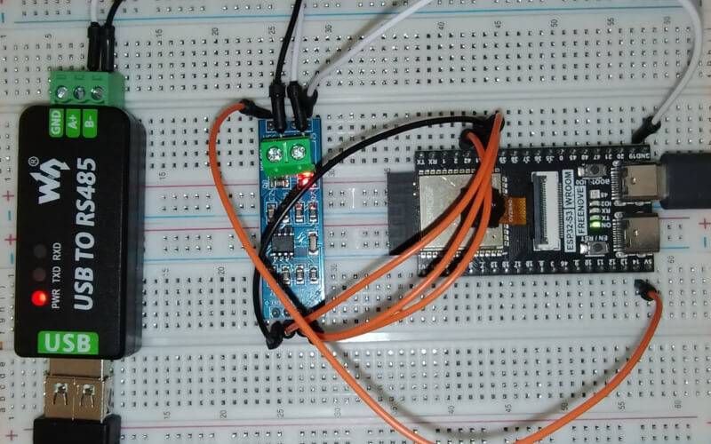

Modbus RTU Module
====================

This Lua module extends the functionality of the Barracuda App Server's Modbus TCP Client by adding support for RTU (RS-232 and RS-485) communication. Essentially, it acts as a driver that enables the Modbus TCP Client to operate as a Modbus RTU Client. This module uses the :ref:`uart-api`.

.. note:: The Lua module is included in the Xedge32 firmware but may be removed in later versions and provided as a separate module.

.. code-block:: lua

   rtu=require"modbus.rtu".create(port, config)

Create a Modbus RTU object.

**Parameters:**

The port and config parameters are sent to the :ref:`uart-func` function. The config table takes one additional option, which optionally sets the `Modbus TCP Client's onclose configuration option <https://realtimelogic.com/ba/doc/?url=Modbus.html#onclose>`_.

**Returns:**

- A new Modbus RTU object with the same API methods as provided by the `Modbus TCP Client <https://realtimelogic.com/ba/doc/?url=Modbus.html>`_. The returned Modbus object is pre-configured for asynchronous cosocket mode, thus a callback is required for all method operations. See the example below for details.

**Example:**

.. code-block:: lua

    local cfg = {
        baudrate = 9600,
        txpin = 42,
        rxpin = 41,
        onclose=function(err) trace("Serial Comm. Err.",err) end
    }

    -- Does not return errors, but may throw on incorrect settings
    mb=require"modbus.rtu".connect(1,cfg)
 
    local function mycallback(data, err, transaction, mb)
       trace("table" == type(data) and ba.json.encode(data) or data, err)
    end
    local unitId=1 -- Optional for RS232, required for multidrop RS485.
    mb:wholding(0, {1,2,3,4,5,6,7,8,9,10,11,12,13,14,15,16,17,18,19,20}, unitId, mycallback)
    mb:rholding(0, 20, unitId, mycallback)

The above callback prints the following, which are the Modbus server's return values for the calls to mb:wholding() and mb:rholding(). The nil value at the end is from the ``err`` argument.

.. code-block:: text

    true  nil
    [1,2,3,4,5,6,7,8,9,10,11,12,13,14,15,16,17,18,19,20]  nil

The above example configures the UART for RS232 mode or full duplex RS485. Half duplex (two-wire) RS485 communication requires collision detection and a chip such as ADM483 wired to the RTS GPIO pin. See the UART option ``rs485`` for details. Half duplex RS485 mode can be configured as follows:

.. code-block:: lua

    local cfg = {
        baudrate = 9600,
        txpin = 42,
        rxpin = 41,
        rtspin=40,
        rs485=true
    }

Modbus Test Bench:
-------------------

(How to set up a two-wire RS485 Modbus test bench)

The following image shows our test bench.

We used the following components for our test bench:

- ESP32s3
- ANMBEST MAX485 RS485 Transceiver Module
- USB to RS485 converter
- Modbus Slave Simulator running on Windows (connected to the USB to RS485 converter)

How to wire the components:
############################

The following wiring matches the above configuration table.

Power Connections
^^^^^^^^^^^^^^^^^

- **VCC** on MAX485 to **5V** on ESP32
- **GND** on MAX485 to **GND** on ESP32

Data Connections
^^^^^^^^^^^^^^^^

- **DI** on MAX485 to GPIO pin 42 on the ESP32: **TX**
- **RO** on MAX485 to GPIO pin 41 on the ESP32: **RX**

Control Pins
^^^^^^^^^^^^
- **RE and DE** on MAX485 connected together, then to GPIO pin 40: **RTS**

RS485 Terminals
^^^^^^^^^^^^^^^

- **A and B** terminals on MAX485 to the A and B lines on the USB to RS485 converter
