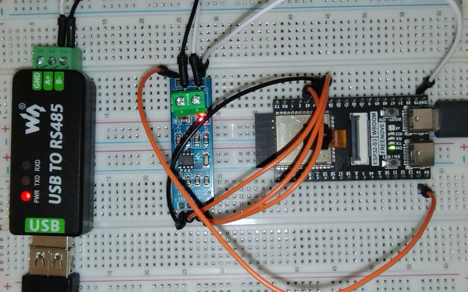

Modbus RTU Module
=================

This Lua module extends the Barracuda App Server Modbus TCP client so it can
communicate over Modbus RTU on serial links such as RS-232 and RS-485. In
practice, the module acts as a transport adapter: it keeps the familiar Modbus
client API while using the :ref:`UART API <uart-api>` for the underlying serial
communication.

.. note::

   The module is currently included in the Xedge32 firmware, but it may be
   moved into a separately distributed Lua module in a future release.

Creating an RTU Client
----------------------

Function signature:

.. code-block:: lua

   mb = require"modbus.rtu".connect(port [,config])

Parameters
~~~~~~~~~~

* ``port`` (integer): required UART port identifier; see :ref:`uart-func`.
* ``config`` (table): optional UART configuration, with the additional fields
  below. The adapter copies the table rather than modifying it.
* ``config.timeout`` (number): response timeout in milliseconds; defaults to
  1000. It starts when a queued request is transmitted. The adapter separately
  sets the UART receive timeout to 4 symbol periods for frame collection.
* ``config.onclose`` (function): optional callback receiving ``err`` (string or
  number) and ``mb`` (client table) when communication ends with an error. See
  the `Modbus client callback rules
  <https://realtimelogic.com/ba/doc/?url=Modbus.html#onclose>`_.

Other settings are forwarded to :ref:`uart-func`. The adapter supplies its own
UART callback and disables pattern matching, so ``config.callback`` and
``config.pattern`` are not used by this connection.

Return values
~~~~~~~~~~~~~

The result ``mb`` (table) is a Modbus object with the same method set as the `Modbus
TCP client <https://realtimelogic.com/ba/doc/?url=Modbus.html>`_.

The returned object is preconfigured for asynchronous cosocket operation, which
means you should provide a callback for each Modbus operation.
The adapter creates and starts its receiving coroutine internally. Its public
connect() function does not return a start function.

Throws
~~~~~~

Invalid configuration can throw in the UART constructor. Failure to create the
UART or start the receiving coroutine also throws. Errors raised by a response
callback are reported through Xedge's error reporting and the client is closed.
RTU request methods require a unit identifier from 1 through 247, defaulting to
1. Unit 0 broadcasts are unsupported and throw before the request is queued or
transmitted. A rejected request leaves the client usable.

Responses and closure
--------------------

Requests are transmitted one at a time. After a response is validated and its
callback returns, the next queued request can transmit. Closing from the callback
prevents that transmission. CRC errors, short invalid replies and timeouts close the
client; a valid Modbus exception response is delivered as its numeric error code.
The next queued request is not transmitted after a CRC error or exception.
Frames addressed to a different unit are ignored. They do not complete the
pending request, release the next queued request, or restart its response timer.
Replies from the requested unit must also match the requested operation and
payload size. The shared Modbus client reports mismatches as ``invalidresponse``.

Calling ``mb:close()`` closes the UART, cancels the response timer, releases
queued outgoing data and wakes a suspended receiver. With the updated Modbus
client, pending callbacks receive ``nil, "closed", transaction, mb`` and
``onclose`` is suppressed for explicit closure. Here ``transaction`` is an
integer identifier and ``mb`` is the client table. The receiving coroutine
delivers these notifications; repeated close calls do not repeat them.

Basic Example
-------------

.. code-block:: lua

   local cfg = {
      baudrate = 9600,
      txpin = 42,
      rxpin = 41,
      onclose = function(err)
         trace("Serial Comm. Err.", err)
      end
   }

   -- Does not return errors, but may throw on incorrect settings
   local mb = require"modbus.rtu".connect(1, cfg)

   local function mycallback(data, err, transaction, client)
      trace("table" == type(data) and ba.json.encode(data) or data, err)
   end

   local unitId = 1
   mb:wholding(0, {1,2,3,4,5,6,7,8,9,10,11,12,13,14,15,16,17,18,19,20}, unitId, mycallback)
   mb:rholding(0, 20, unitId, mycallback)

The callback above prints results similar to:

.. code-block:: text

   true  nil
   [1,2,3,4,5,6,7,8,9,10,11,12,13,14,15,16,17,18,19,20]  nil

RS-232, Full-Duplex RS-485, and Half-Duplex RS-485
--------------------------------------------------

The first example configures the UART for RS-232 or full-duplex RS-485.

For half-duplex two-wire RS-485, you also need collision-detection support and
a suitable transceiver such as ADM483 wired to the RTS GPIO pin. In that case,
enable the UART ``rs485`` option:

.. code-block:: lua

   local cfg = {
      baudrate = 9600,
      txpin = 42,
      rxpin = 41,
      rtspin = 40,
      rs485 = true
   }

Modbus Test Bench
-----------------

The image below shows a simple two-wire RS-485 test setup.

Test Bench Components
~~~~~~~~~~~~~~~~~~~~~

- ESP32-S3
- ANMBEST MAX485 RS485 transceiver module
- USB-to-RS485 converter
- A Modbus slave simulator running on Windows and connected to the converter

Wiring Example
~~~~~~~~~~~~~~

The following wiring matches the half-duplex configuration shown earlier.

Power connections:

- **VCC** on MAX485 to **5V** on the ESP32
- **GND** on MAX485 to **GND** on the ESP32

Data connections:

- **DI** on MAX485 to GPIO 42 on the ESP32 for **TX**
- **RO** on MAX485 to GPIO 41 on the ESP32 for **RX**

Control pin:

- **RE** and **DE** connected together, then wired to GPIO 40 for **RTS**

RS-485 bus terminals:

- **A** and **B** on the MAX485 to the matching **A** and **B** lines on the
  USB-to-RS485 converter

For longer RS-485 wiring, also consider termination and biasing. Short bench
tests may work without them, but production wiring should follow normal RS-485
bus design rules.

Practical Guidance
------------------

- Use RS-232 or full-duplex RS-485 when the wiring and hardware already support
  separate send and receive paths.
- Use half-duplex RS-485 when you need a multidrop industrial bus, but make
  sure your transceiver and RTS wiring are configured correctly.
- Keep the callback-based programming style from the Modbus client API; the RTU
  transport layer is designed around asynchronous requests and responses.
- If requests time out, first verify baud rate, parity, slave unit ID, A/B
  polarity, and shared ground before changing the Lua code.
